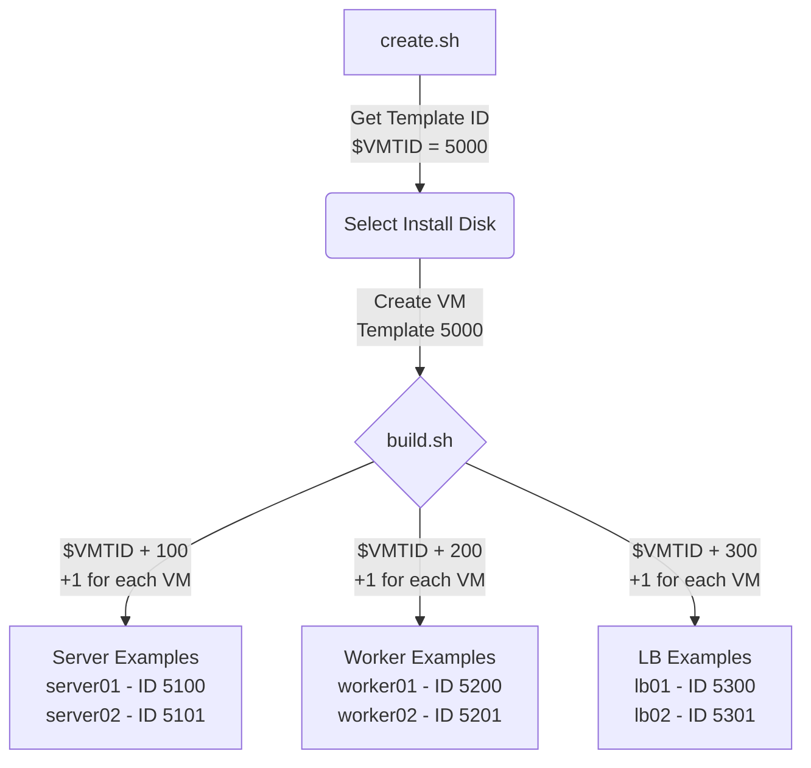

# Proxmox Bulk Deploy #

Deploy a large amount of generic/reusable VM's in a fast, safe and efficent
manner with the added plus of not requiring any large automation/deployment
solutions such as Terraform, Ansible, Chef or Salt..this script for the
most part should be portable between Linux distros.



<p align=center>
    
```bash
+-----------------------+       +----------------------+
|   STEP 1: BUILD       |       |   STEP 2: CREATE     |
|-----------------------|       |----------------------|
| • Minimal config      |       | • Rapid VM deploy    |
| • Hardware‑agnostic   | --->  | • Talos / future     |
| • Nothing to install  |       |   flavors ready      |
| • Storage‑type prompt |       | • Hooks: ZFS, Ceph   |
+-----------------------+       +----------------------+
```
</p>

## Templates and Clones ##

- [x] Functional two-step script
- [x] Hardware agnostic
- [x] Add visual metrics - in addition to logging
- [x] Add ZFS - other options (scripts are pre-configured with LVM-Thin)
- [x] Addititional OS choices (VIA --image flag)
- [ ] Add automated image download to eliminate file management
- [ ] Killswitch script - shutdown, delete, housekeeping in one script

This is desinged to be simple press and go script that is system agnostic
with minimal to no additional configuration required compared to other
tools like Ansible, Packer or Terraform.

> [!TIP]
> For best performance and ease of use, it is recommended to run these scripts
> locally and stream ISO/Images from offload such as a NAS, SAN, or similar
> Deploying many VM's at the same time will place significant strain on the
> network and drives. One can greatly improve the performance of the deployment
> if there are multiple nodes or drives to store images on exclusively.

This tool enables one to easily spin up 20+ logical VM's in a matter of minutes. 
This is of course assuming requirements are met for hardware, network, storage, 
staff and the underlying infrastructure to support all of it. My professional 
background includes various compliance related items such as PCI-DSS, GDPR, 
and HIPPA will do my best to apply this where appropriate. With that said 
this tool comes with zero warranty or liability, this is a 'for fun'
resource and should never be a substitue or replacement for certified and 
experienced industry experience. Even for fun always be alert, check the script
before you run the code, check the drive before you nuke it and think before
you execute.

> [!CAUTION]
> 💻 **Operator’s Oath** 
> 
> 🚫 **Obscurity is not security** — bots don't care you put it on port 44523.”  
> 🔓 **Open ports are an open invitation** — and the guests don’t bring snacks.  
> 📊 **Know your threat level** — ignorance is a privilege your firewall can’t afford.  
> 🧠 **Don’t overthink; use common sense** — but verify like you’re paid by the log entry.  
> 🔑 **Password is not a password** — yes, someone already tried it. Successfully.

### Proxmox Cloud-Init Template Generator ###

Script documentation is a work in progress. 

#### Clone the Repo #### 
```bash
git clone https://github.com/meabert/Proxmox-Bulk-Deploy/ && cd Proxmox-Bulk-Deploy
```
##### Test out the script #####
Make the scripts executable
```bash
chmod +x build.sh create.sh storage-selector.py
```
Run the template maker with the --image flag, use this to tell the script where
you keep your image
```bash
./create.sh --image /myimages/debian-13.qcow
```
The script will prompt you to pick an ID number for the template.
Pick the disk you want the template on
Provide username for cloudinit
Provide password for cloudinit
Template specific values saved to .template.env

Run the VM creation script - this will prompt for servers, workers and load
balancers (three sets) labeling will be configured automatically which is 
particularly useful for clustered services - i.e. Kubernetes, Docker Swarm, 
CephFS, etcd, databases...etc
```bash
./build.sh
```

> [!WARNING]
> For ease of use all scripts SSH use default password authentication,
> this will be stored as hashed value in a file after creation for
> record-keeping and as a development resource to expand the functionality
> of these scritps.
>
> Environment Variables File:
> <b>.template.env</b>
> 
> Be sure to .gitignore this file since it will have sensitive information

```mermaidflowchart 
LRA[STEP 1: BUILD] --> B[STEP 2: CREATE]A -->|Minimal config| BA -->|Hardware‑agnostic| BA -->|Storage‑type prompt| BB -->|Hooks: ZFS, Ceph, Talos ready| C[Future‑proof]
```

###### Friendly reminders and checklists for so many VM's ######

+ Turn off password authentication for SSH once keys are setup
+ Minimum attack surface, if you don't need the port don't open it
+ SSL is useful even with [airgapped systems](https://www.bleepingcomputer.com/news/security/etherled-air-gapped-systems-leak-data-via-network-card-leds/) - physical access is a thing
+ Utilize all available tools together to create a unified solution
  - systemd - allow or deny access to sockets IPAddressAllow / IPAddressDeny
  - nftables - iptables [replacement](https://wiki.nftables.org/wiki-nftables/index.php/What_is_nftables%3F) for packet filtering (firewalling), NAT,
    mangling and packet classification
  - single sign on - authentik, authelia, keycloak, auth0
  - network level authentication - mac filtering, radius, static routes
  - segment your networks - most modern routers support some form of VLANs
    
+ Proxies are you friend and there's a lot - Nginx Proxy Manager, Caddy, Traefik
+ Proxy Everything behind a VPS - Pangolin
+ Site to Site VPN - UniFi Ecosystem
+ CloudFlare Tunnel - No Port Forwarding
+ WireGuard / TailScale / Headscale / Netmaker - VPN 


